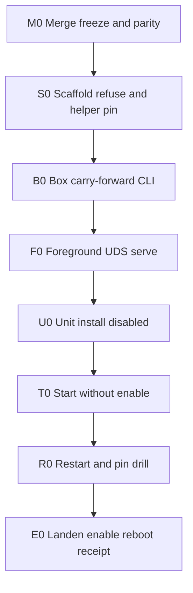

# Serve-closed after merge

> **For agentic workers:** Use subagent-driven-development or executing-plans task-by-task. Steps use checkbox tracking.

**Goal:** After `spine1/live-box` (and related topic) commits/pushes/merges land, honestly claim **Serve-closed** on aegisbox with destination evidence, without reopening Box-closed or claiming four_plane / atoms enforce.

**Architecture:** Scaffold identity and fail-closed config before any long-lived socket. Foreground UDS prove first (transport), then systemd start-without-enable (sandbox), then Landen-gated enable+reboot. Chain stays tip-anchored (not attested). Inspector stays out of band.

**Tech stack:** Rust `isolation-manager serve`, host decision chain, `jailer-launch` sudo helper, systemd unit + drop-in env pins, existing scripts (`guest-gone-probe`, `neg-chain-unwritable`, `boxclosed-parity`).

## Global constraints

- Box-closed remains a historical green tip (`b036fb0f…` lineage); do not reopen as the done-bar.
- `four_plane_complete` refused; atoms enforce off; no chain truncate heal.
- Tip-of-record ≠ attestation; SPEAK/receipt keep that wording.
- sudo: NOPASSWD jailer present **and** host `(ALL:ALL) ALL` — never claim scoped-only.
- No `systemctl enable` without explicit Landen gate.
- No public push unless Landen names it (merge/push of topic roofs is the named gate for this plan).
- Career lab still does not start Firecracker.

## Council synthesis (direction)

| Seat | Question | Contribution |
|---|---|---|
| [Opus](addfd2de-cb31-4804-8fbd-31b0ce131207) | Highest-risk residual if Serve next | Serve never measured; systemd sandbox untested; uncommitted provenance; uid-only socket; tip not attested |
| [Sol](d57d9cb7-17e9-47bc-a9da-fc2fc02846f8) | Ordered checkpoints | 11-step matrix: merge freeze → box HEAD → scaffold → refuse-config → helper pin → Box carry-forward → foreground serve → unit install (disabled) → start → restart drill → enable+reboot+receipt |
| [Codex](64bb964f-e285-44ab-8ec9-c0d38fb2febe) | Kill-list vs CLI⇒Serve | Anchor pin, false liveness, tip growth, starvation, binary identity, privilege overclaim, inspector scope, no truncate heal, restart pin rotation, category error |

**Primary recommendation:** Serve-closed is the correct next done-bar after merges.

**Strongest dissent (Opus):** long-lived socket in front of NOPASSWD root helper widens landen-uid drive of jailer; caller identity (SO_PEERCRED / grant) arguably before Serve. **Plan resolution:** Serve-closed claim language is **uid-only socket** (not “unauthorized peers refused”); peercred is a named residual for four_plane, not a Serve blocker. Kill-list items 1–5, 8–9 must be green before enable.

## File map (Serve-closed wave)

- Modify: [`crates/isolation-manager/src/serve.rs`](C:/Users/lande/Engineering_and_Development/isolation-layer/crates/isolation-manager/src/serve.rs) — return `jail_id`+`tip` in JSON; bound read; optional write timeout; document uid-only.
- Modify: [`deploy/systemd/isolation-manager.service`](C:/Users/lande/Engineering_and_Development/isolation-layer/deploy/systemd/isolation-manager.service) — drop-in friendly pins; fix ExecStartPre so `REQUIRE_ANCESTOR` is required via EnvironmentFile/drop-in (no shell expansion surprise).
- Create: `deploy/systemd/isolation-manager.service.d/continuity.conf.example` — `REQUIRE_ANCESTOR=` + `AEGIS_JAILER_SHA256=` placeholders.
- Create: `scripts/serve-uds-prove.sh` — one-shot socket prove client (valid / bad JSON / unknown cmd / dual client).
- Create: `scripts/serve-closed-parity.sh` — deepen parity: active/enabled/socket mode/runtime exe hash.
- Create: `docs/RECEIPT-SERVE-CLOSED-2026-10-03.md` — final destination receipt.
- Modify: [`docs/REMAINDER-SPINE1-2026-10-03.md`](C:/Users/lande/Engineering_and_Development/isolation-layer/docs/REMAINDER-SPINE1-2026-10-03.md) — tip `b036fb0f…` / harden proved; Serve status; peercred residual.
- Modify: [`docs/FRONTIER-SHIP-CHECKS-2026-10-03.md`](C:/Users/lande/Engineering_and_Development/isolation-layer/docs/FRONTIER-SHIP-CHECKS-2026-10-03.md) — Serve rows.
- Modify: SPEAK Live box line only after last serve prove tip (T7-class dest-sync; no second prove after sync).
- Also write plan copy on execute to `isolation-layer/docs/superpowers/plans/2026-10-03-serve-closed.md`.

---

### Task 0: Merge freeze (precondition)

**Files:** git roofs `isolation-layer` (`spine1/live-box`), `aegis-atoms-estate` if still dirty, Job_Search SPEAK/receipt if in the ship set.

- [ ] **Step 1:** Landen/Cursor commit harden + receipts on topic branches (public pace). Isolation first.
- [ ] **Step 2:** Push/merge only remotes on push_gate allowlist; no force-push.
- [ ] **Step 3:** Record `MERGED_HEAD=$(git rev-parse HEAD)` and helper/manager SHAs from clean build.

**Done:** porcelain clean on merged default or merged topic tip; `MERGED_HEAD` written into working Serve receipt draft header.

**Red:** dirty tree → stop; no box sync.

---

### Task 1: Box source identity

**Files:** [`scripts/sync-to-aegisbox.sh`](C:/Users/lande/Engineering_and_Development/isolation-layer/scripts/sync-to-aegisbox.sh) expand if tar path kept.

- [ ] **Step 1:** On aegisbox, checkout/sync exact `MERGED_HEAD` (prefer git; tar only if private).
- [ ] **Step 2:** `git rev-parse HEAD` host==box OR full load-bearing sha256 manifest zero-diff (include `serve.rs`, unit, Cargo.lock, scripts).
- [ ] **Step 3:** `cargo test --workspace` + `cargo build --release -p jailer-launch -p isolation-manager` exit 0.

**Done:** source identity match + green workspace test/build.

**Red:** do not reuse prior binaries.

---

### Task 2: Serve refuse-config scaffold

**Files:** `serve.rs` (already refuses missing ancestor); add tests or script asserts.

- [ ] **Step 1:** `env -u REQUIRE_ANCESTOR -u ALLOW_GENESIS ./target/release/isolation-manager serve --socket /tmp/refuse.sock` → exit 1, no socket.
- [ ] **Step 2:** Both `REQUIRE_ANCESTOR` and `ALLOW_GENESIS=1` → exit 1 mutually exclusive.
- [ ] **Step 3:** `systemd-analyze verify deploy/systemd/isolation-manager.service` exit 0 (unit still disabled).

**Done:** refuse-config green; unit not installed yet.

---

### Task 3: Helper pin + Box carry-forward

**Files:** scripts already pin `AEGIS_JAILER_SHA256` from installed.

- [ ] **Step 1:** Landen `sudo install` if rebuild changed helper; `sha256sum` built==installed.
- [ ] **Step 2:** `REQUIRE_ANCESTOR=b036fb0f… bash scripts/guest-gone-probe.sh --session-id serve-preflight --tool-call-id merged` exit 0.
- [ ] **Step 3:** `bash scripts/neg-chain-unwritable.sh` → `NEG_UNWRITABLE_REAL_OK`.
- [ ] **Step 4:** Capture new tip as `PIN` (must ≠ frozen tip if grew; ancestor still in chain).

**Done:** CLI continuity green under merged bits; `PIN` recorded.

**Do not claim:** Serve-closed.

---

### Task 4: Foreground UDS serve (transport)

**Files:** Create `scripts/serve-uds-prove.sh`; modify `serve.rs` to emit `{"ok","exit","jail_id","tip"}`.

- [ ] **Step 1:** Implement response fields + read bound before allocating huge lines; cargo test/build.
- [ ] **Step 2:** Foreground: `REQUIRE_ANCESTOR=$PIN AEGIS_JAILER_SHA256=<installed> ./target/release/isolation-manager serve --socket $HOME/.local/state/aegis/isolation-manager.sock`
- [ ] **Step 3:** Socket `stat` mode 0600 owner landen.
- [ ] **Step 4:** Bad JSON + unknown cmd → `ok:false`; chain tip unchanged.
- [ ] **Step 5:** Valid prove JSON → `ok:true`, tip advances, verify PASS, residue empty.
- [ ] **Step 6:** Dual-client / slow-client starvation drill (Codex #4): second prove must succeed within declared bound or code-fix before enable.
- [ ] **Step 7:** Stop foreground serve.

**Done:** UDS path measured; kill-list 2–4 green for foreground.

**Red:** unit still disabled/uninstalled.

---

### Task 5: Unit install disabled + sandbox probe

**Files:** unit + `continuity.conf.example` → Landen root drop-in with live `PIN` and helper sha.

- [ ] **Step 1:** Landen install unit file; install drop-in with exact pins; `ALLOW_GENESIS` absent.
- [ ] **Step 2:** `systemctl is-enabled` still disabled; `systemctl cat` shows pins.
- [ ] **Step 3:** Landen `systemctl start` (not enable). Measure: active, socket 0600, socket prove ok, tip grows, residue empty, `sudo -u nobody` denied.
- [ ] **Step 4:** Sandbox honesty: run residue checks aware of `PrivateTmp` (probe from service namespace or document host `/tmp` blind). Symlink `/opt/aegis` + `ProtectHome` must not block jailer writes (Opus #2).
- [ ] **Step 5:** SIGKILL restart drill: unit returns active; pin still valid; prove ok (Codex #9).

**Done:** managed start green; still not enabled.

---

### Task 6: Landen enable + reboot + Serve receipt

- [ ] **Step 1:** Explicit Landen GO for enable.
- [ ] **Step 2:** `systemctl enable` + reboot.
- [ ] **Step 3:** Post-boot: active+enabled, env pins, runtime exe hash == release artifact, one socket prove, tip growth, residue zero.
- [ ] **Step 4:** Write [`docs/RECEIPT-SERVE-CLOSED-2026-10-03.md`](C:/Users/lande/Engineering_and_Development/isolation-layer/docs/RECEIPT-SERVE-CLOSED-2026-10-03.md) with MERGED_HEAD, hashes, PIN, FINAL_TIP, kill-list table, systemd-on, residuals (uid-only, unattested, inspector OOB, sudo ALL, FALSE-ALLOWs).
- [ ] **Step 5:** Deepen `serve-closed-parity.sh` / frontier checks; SPEAK tip dest-sync to FINAL_TIP only; career retest; **no second prove after tip sync**.
- [ ] **Step 6:** Bump remainder: Serve-closed closed; peercred/grant residual open for four_plane.

**Serve-closed done bar:** merged source → pinned artifacts → mandatory ancestor → owner-only UDS → valid/concurrent jobs append verifiable chain with no residue → systemd survives kill+reboot → receipt dest-reads agree. Explicit non-claims listed.

---

## Parallelism

- Cursor: Task 0 commit/claim review + receipt/SPEAK pen.
- CC: Tasks 1–4 grind on box after merge tip exists.
- Landen: sudo install, unit install, start/enable/reboot gates (Tasks 3/5/6).

## Explicit non-claims after green

four_plane_complete · atoms enforce · chain attestation · inspector in-chain · scoped-only sudo · FALSE-ALLOW closers · bare-metal TCB equivalence.
